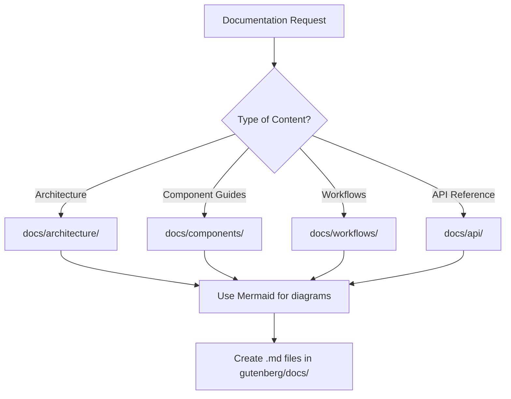
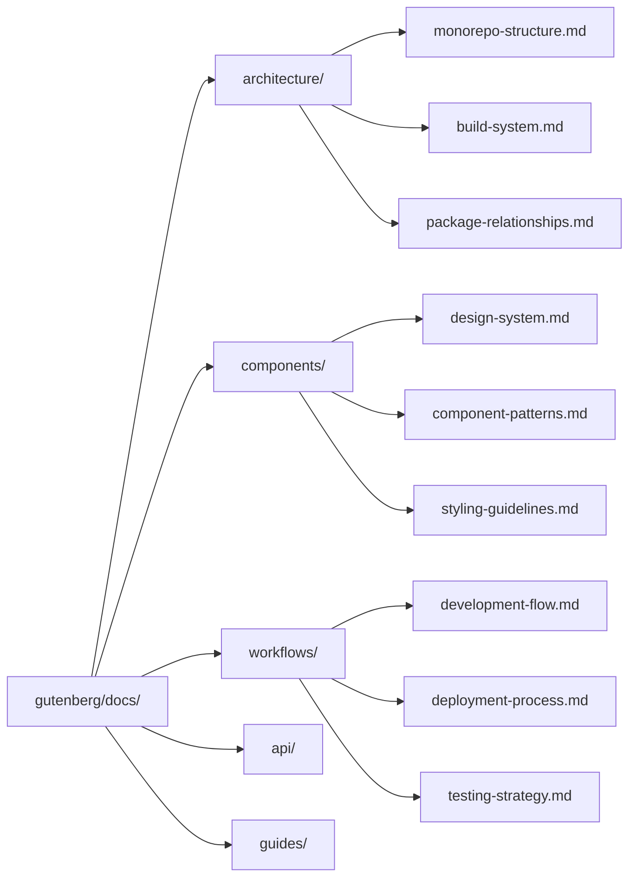

# Claude Code King - AI Coding Agent Instructions

## Project Overview

A modern **shadcn/ui monorepo** with three main areas:

- **`apps/web/`** - Next.js 15+ app using App Router, React 19, TypeScript, Tailwind CSS
- **`packages/ui/`** - Reusable shadcn/ui component library with Radix UI primitives
- **`gutenberg/`** - Docusaurus documentation site

Built with **Turborepo**, **pnpm workspaces**, and modern tooling for scalable component-driven development.

## Architecture Patterns

### Monorepo Structure

- **Apps consume packages via workspace imports**: `@workspace/ui`, `@workspace/eslint-config`, `@workspace/typescript-config`
- **Package exports pattern**: Each package defines specific exports in `package.json` rather than barrel exports
- **Dependency hoisting**: Root manages shared dependencies, packages own their specific needs

### Component System

- **shadcn/ui integration**: Add components with `pnpm dlx shadcn@latest add <component> -c apps/web` → places in `packages/ui/src/components/`
- **Import pattern**: `import { Button } from "@workspace/ui/components/button"` (NOT barrel imports)
- **Styling system**: `cn()` utility combines clsx + tailwind-merge for conditional classes
- **Variant system**: Uses `class-variance-authority` for component variants (see `Button` example)

### Configuration Architecture

- **Shared configs**: ESLint (`@workspace/eslint-config`), TypeScript (`@workspace/typescript-config`) consumed by all packages
- **Environment management**: `@workspace/config-manager` provides `loadEnv()` and `get()` utilities
- **Turborepo tasks**: Defined in `turbo.json` with dependency graphs (`"dependsOn": ["^build"]`)

## Development Workflows

### Essential Commands

```bash
# Root development (all packages in watch mode)
pnpm dev

# Component management
pnpm dlx shadcn@latest add <component> -c apps/web  # Adds to packages/ui/
pnpm dlx shadcn@latest init                         # Initialize shadcn config

# Build pipeline
pnpm build      # Builds all packages via Turborepo
pnpm lint       # Lints all packages
pnpm format     # Prettier formatting

# Documentation
cd gutenberg && pnpm start  # Docusaurus dev server
```

### Documentation Workflow

- **All documentation goes in `gutenberg/` (Docusaurus site)**
- **Structure**: Follow `docs/` folder organization with proper categories
- **Visualizations**: Use Mermaid diagrams for flow charts and architecture diagrams
- **No code in docs**: Keep documentation pure - reference code files, don't embed them
- **Sidebars**: Auto-generated from folder structure via `sidebars.ts`



### Package Development

- **Add new packages**: Create in `packages/`, follow workspace import pattern
- **UI package exports**: Define in `package.json` exports field, not index files
- **Cross-package dependencies**: Use `"workspace:*"` in package.json

### Component Development

1. **Add shadcn component**: `pnpm dlx shadcn@latest add <name> -c apps/web`
2. **Customize in packages/ui**: Modify generated component, maintain export pattern
3. **Use in apps**: Import directly from `@workspace/ui/components/<name>`

## Technology Constraints

### Required Patterns

- **React 19**: Use new features like `use()` hook, avoid deprecated patterns
- **Next.js 15**: App Router only, leverage Turbopack for dev (`--turbopack`)
- **TypeScript strict mode**: All packages use strict TypeScript configuration
- **ESM only**: All packages use `"type": "module"`, avoid CommonJS

### Styling System

- **Tailwind CSS 4.0**: Uses new PostCSS architecture
- **CSS custom properties**: Components use CSS variables for theming
- **Dark mode**: Handled via `next-themes` with class strategy
- **Component slots**: Use `data-slot` attributes for styling hooks

### Quality Standards

- **ESLint configuration**: Uses flat config format, shared across packages
- **Only warnings**: Uses `eslint-plugin-only-warn` - no errors, only warnings
- **Turborepo integration**: `turbo/no-undeclared-env-vars` rule enforced

## Integration Points

### Theme System

- **Provider setup**: `apps/web/components/providers.tsx` configures `next-themes`
- **CSS variables**: Components reference theme colors via CSS custom properties
- **Font variables**: Geist font system with CSS variables (`--font-sans`, `--font-mono`)

### Build System

- **Turborepo caching**: Configured for optimal builds with dependency tracking
- **TypeScript compilation**: Shared configs ensure consistent compilation across packages
- **Hot reloading**: Turbopack provides fast dev experience across packages

### External Dependencies

- **Radix UI**: Foundational primitive components for accessibility
- **Lucide React**: Icon system across all components
- **Zod**: Schema validation (used in form components)
- **Date-fns**: Date utilities (for calendar/date components)

## Cross-Package Communication

### State Management

- No global state library - prefer React 19 patterns and component composition
- Use context sparingly, prefer prop drilling for component communication
- Form state via `react-hook-form` with Zod validation

### Type Sharing

- Types defined close to usage, not in shared type packages
- Use workspace TypeScript project references for type checking
- Leverage TypeScript's module resolution for cross-package types

## Claude Code Agent Integration

### Existing Agent Setup

- **Location**: `.claude/agents/` and `.claude/commands/` directories exist
- **Specialized agents**: 50+ domain-specific agents configured with model assignments
- **Slash commands**: 52 production-ready commands for complex workflows

### Agent Usage Patterns

- **Frontend development**: Use `frontend-developer` and `ui-ux-designer` agents
- **Component creation**: `ui-ux-designer` for design system consistency
- **Build/deployment**: `devops-troubleshooter` and `deployment-engineer` agents
- **Code quality**: `code-reviewer` with focus on configuration security

### Recommended Workflows

```bash
# Component development
/api-scaffold component with shadcn integration
# Use frontend-developer agent for React 19 patterns

# Build optimization
/multi-agent-optimize focus on Turborepo and build performance
# Leverage performance-engineer agent

# Documentation
/doc-generate integrate with Docusaurus setup in gutenberg/
# Always write docs in gutenberg/ with Mermaid diagrams for flows
```

## Documentation Standards

### Docusaurus Integration

- **Location**: All documentation in `gutenberg/docs/` following folder structure
- **Mermaid Support**: Use Mermaid diagrams for architecture and flow visualizations
- **Pure Documentation**: No code blocks - reference files and explain concepts
- **Auto-generated Sidebars**: Folder structure automatically creates navigation

### Documentation Categories



### Content Guidelines

- **Flow Diagrams**: Use Mermaid for all process flows and architecture diagrams
- **Reference Pattern**: Link to code files, don't embed code snippets
- **Conceptual Focus**: Explain the "why" behind architectural decisions
- **Folder Organization**: Group related docs in subdirectories with `_category_.json`

## Common Pitfalls to Avoid

- **Don't use barrel exports** - Import directly from component files
- **Don't mix import patterns** - Always use `@workspace/ui/components/X` not relative paths
- **Don't skip dependency graphs** - Update `turbo.json` when adding package dependencies
- **Don't ignore workspace protocol** - Use `workspace:*` for internal dependencies
- **Don't modify shadcn configs manually** - Use CLI commands for consistency

## Key Files for Understanding

- **`turbo.json`** - Build orchestration and caching configuration
- **`packages/ui/package.json`** - Component library export patterns
- **`packages/ui/src/components/button.tsx`** - Reference component implementation
- **`packages/eslint-config/base.js`** - Shared linting configuration
- **`apps/web/app/layout.tsx`** - App-level provider and theme setup
