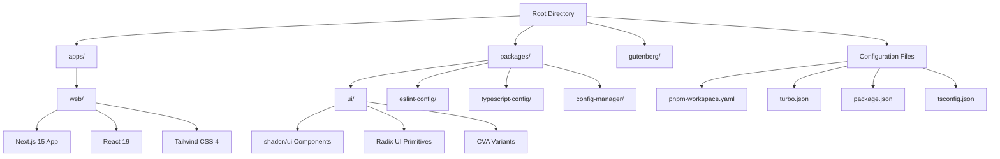
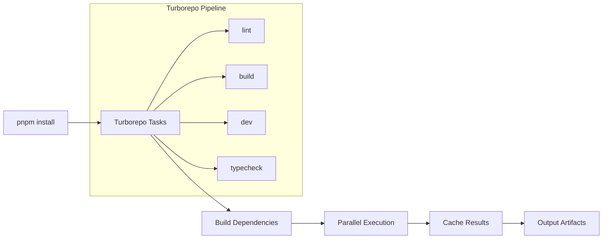
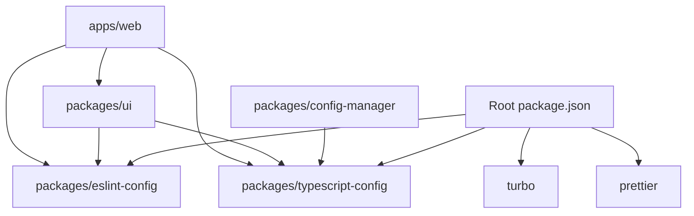
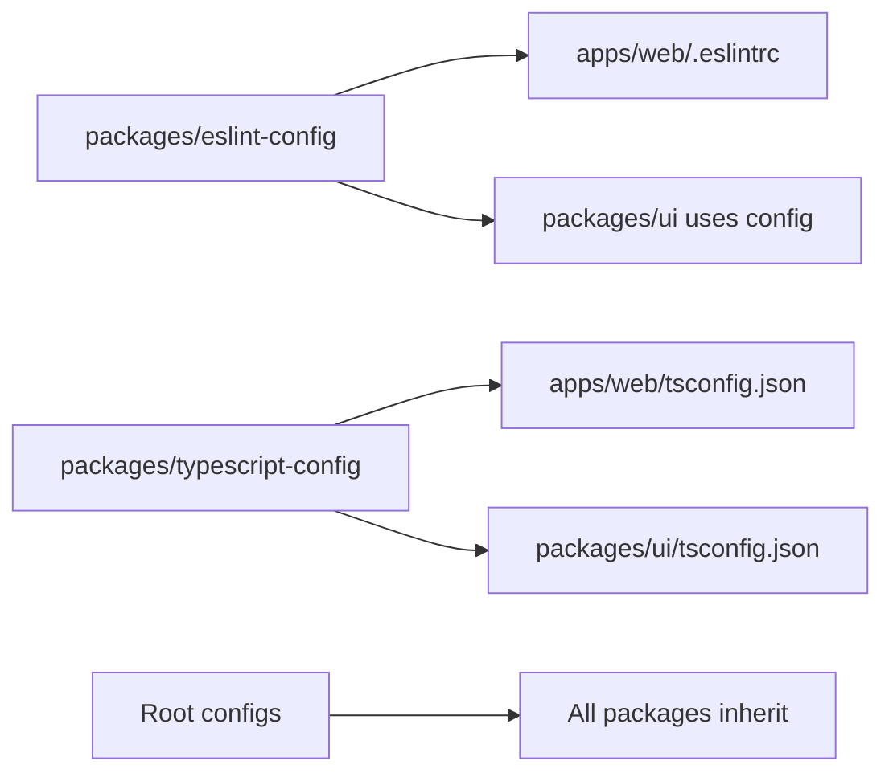
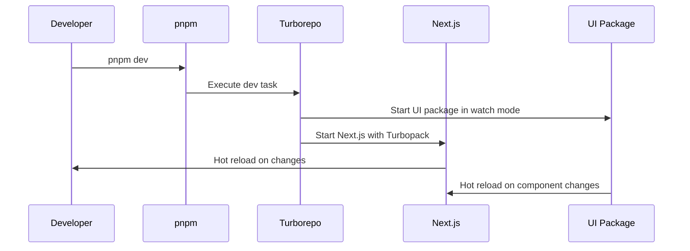
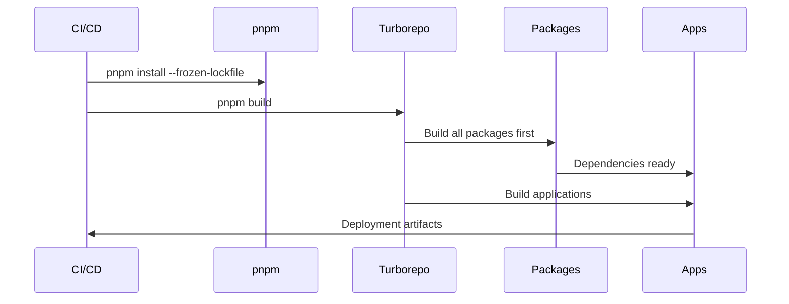

# Architecture Overview

Claude Code King follows a modern monorepo architecture designed for scalability, maintainability, and developer experience. This document outlines the core architectural decisions and patterns.

## Monorepo Structure



## Core Principles

### 1. Workspace Architecture

The monorepo leverages **pnpm workspaces** for dependency management and **Turborepo** for build orchestration:

- **Apps consume packages**: Applications import from packages using `@workspace/*` protocol
- **Package exports pattern**: Each package defines specific exports rather than barrel exports
- **Dependency hoisting**: Root manages shared dependencies, packages own specific needs

### 2. Build System



**Key Features**:
- **Incremental builds**: Only rebuilds changed packages
- **Dependency graphs**: Ensures correct build order with `"dependsOn": ["^build"]`
- **Parallel execution**: Maximizes CPU utilization
- **Remote caching**: Shares build artifacts across teams (configurable)

### 3. Package Relationships



## Technology Stack

### Frontend Architecture

- **Next.js 15**: App Router with React Server Components
- **React 19**: Latest features including `use()` hook and improved Suspense
- **TypeScript 5.7**: Strict mode with shared configurations
- **Tailwind CSS 4**: New PostCSS architecture with custom properties

### Component System

- **shadcn/ui**: CLI-managed component library
- **Radix UI**: Accessible primitive components
- **Class Variance Authority**: Type-safe component variants
- **CSS Variables**: Theme system with dark mode support

### Development Tools

- **Turbopack**: Fast development bundler (Next.js dev mode)
- **ESLint**: Flat config format with shared rules
- **Prettier**: Consistent code formatting
- **TypeScript**: Project references for cross-package types

## Configuration Architecture

### Shared Configurations



### Environment Management

The `@workspace/config-manager` package provides:
- **loadEnv()**: Environment variable loading
- **get()**: Type-safe configuration access
- **Validation**: Runtime config validation

## Build Pipeline

### Development Flow



### Production Build



## Package Design Patterns

### Import Patterns

```typescript
// ✅ Correct - Direct imports from packages
import { Button } from "@workspace/ui/components/button"
import { cn } from "@workspace/ui/lib/utils"

// ❌ Avoid - Barrel exports
import { Button } from "@workspace/ui"
```

### Component Patterns

```typescript
// packages/ui/src/components/button.tsx
import { cva, type VariantProps } from "class-variance-authority"

const buttonVariants = cva(
  "inline-flex items-center justify-center",
  {
    variants: {
      variant: {
        default: "bg-primary text-primary-foreground",
        destructive: "bg-destructive text-destructive-foreground",
      },
      size: {
        default: "h-10 px-4 py-2",
        sm: "h-9 rounded-md px-3",
      },
    },
    defaultVariants: {
      variant: "default",
      size: "default",
    },
  }
)
```

## Integration Points

### Theme System

- **CSS Variables**: Components use theme tokens
- **Dark Mode**: Handled via `next-themes` with class strategy
- **Component Slots**: Use `data-slot` attributes for styling hooks

### State Management

- **React 19 Patterns**: Prefer built-in hooks and patterns
- **Context Sparingly**: Use context for theme and global state only
- **Form State**: `react-hook-form` with Zod validation

This architecture provides a solid foundation for scalable component-driven development while maintaining excellent developer experience and build performance.