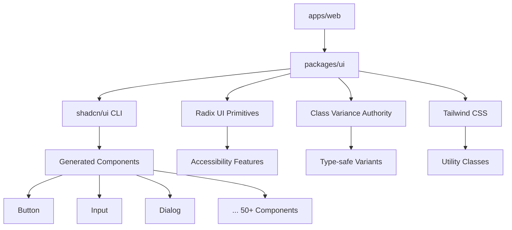
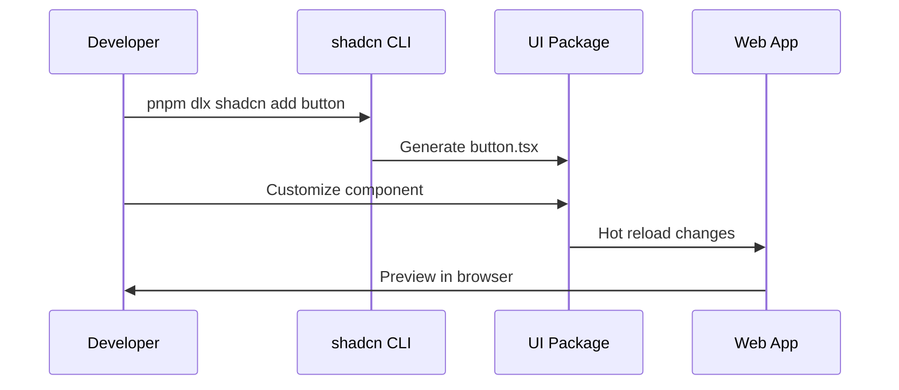

# Component System Overview

The Claude Code King component system is built on shadcn/ui, providing a complete design system with accessibility, customization, and developer experience at its core.

## Architecture



## Core Technologies

### shadcn/ui Integration

The component system leverages shadcn/ui's approach:
- **CLI-managed**: Components added via `pnpm dlx shadcn@latest add <component>`
- **Customizable**: Full source code in your repository
- **Composable**: Built on Radix UI primitives
- **Styled**: Tailwind CSS with CSS variables

### Design Principles

1. **Accessibility First**: WCAG compliant via Radix UI
2. **Customizable**: Override styles without losing functionality
3. **Composable**: Combine primitives to build complex UIs
4. **Type Safe**: Full TypeScript support with variant types

## Component Categories

### Form Components
- **Input**: Text inputs with validation states
- **Button**: Action triggers with multiple variants
- **Select**: Dropdown selections with search
- **Checkbox/Radio**: Selection controls
- **Textarea**: Multi-line text input

### Layout Components
- **Card**: Content containers with headers/footers
- **Separator**: Visual content division
- **Tabs**: Tabbed content organization
- **Accordion**: Collapsible content sections

### Feedback Components
- **Alert**: Status messages and notifications
- **Toast**: Temporary notifications (via Sonner)
- **Progress**: Loading and progress indicators
- **Badge**: Labels and status indicators

### Navigation Components
- **Navigation Menu**: Primary navigation
- **Breadcrumb**: Hierarchical navigation
- **Pagination**: Content navigation
- **Command**: Command palette interface

### Overlay Components
- **Dialog**: Modal dialogs and confirmations
- **Popover**: Contextual overlays
- **Tooltip**: Helpful text overlays
- **Sheet**: Slide-out panels

## Usage Patterns

### Basic Component Usage

```typescript
import { Button } from "@workspace/ui/components/button"

export function Example() {
  return (
    <Button variant="default" size="lg">
      Click me
    </Button>
  )
}
```

### Variant System

Components use Class Variance Authority for type-safe variants:

```typescript
// Button component definition
const buttonVariants = cva(
  "inline-flex items-center justify-center whitespace-nowrap rounded-md text-sm font-medium",
  {
    variants: {
      variant: {
        default: "bg-primary text-primary-foreground hover:bg-primary/90",
        destructive: "bg-destructive text-destructive-foreground hover:bg-destructive/90",
        outline: "border border-input bg-background hover:bg-accent hover:text-accent-foreground",
        secondary: "bg-secondary text-secondary-foreground hover:bg-secondary/80",
        ghost: "hover:bg-accent hover:text-accent-foreground",
        link: "text-primary underline-offset-4 hover:underline",
      },
      size: {
        default: "h-10 px-4 py-2",
        sm: "h-9 rounded-md px-3",
        lg: "h-11 rounded-md px-8",
        icon: "h-10 w-10",
      },
    },
    defaultVariants: {
      variant: "default",
      size: "default",
    },
  }
)
```

### Composition Patterns

```typescript
import { Card, CardContent, CardHeader, CardTitle } from "@workspace/ui/components/card"
import { Button } from "@workspace/ui/components/button"
import { Input } from "@workspace/ui/components/input"

export function LoginForm() {
  return (
    <Card className="w-[350px]">
      <CardHeader>
        <CardTitle>Login</CardTitle>
      </CardHeader>
      <CardContent>
        <div className="grid w-full items-center gap-4">
          <Input placeholder="Email" />
          <Input type="password" placeholder="Password" />
          <Button className="w-full">Sign In</Button>
        </div>
      </CardContent>
    </Card>
  )
}
```

## Styling System

### CSS Variables

Components use CSS custom properties for theming:

```css
:root {
  --background: 0 0% 100%;
  --foreground: 222.2 84% 4.9%;
  --primary: 222.2 47.4% 11.2%;
  --primary-foreground: 210 40% 98%;
  /* ... more variables */
}

[data-theme="dark"] {
  --background: 222.2 84% 4.9%;
  --foreground: 210 40% 98%;
  /* ... dark theme overrides */
}
```

### Utility Classes

```typescript
import { cn } from "@workspace/ui/lib/utils"

// Conditional styling
const className = cn(
  "base-classes",
  {
    "active-classes": isActive,
    "disabled-classes": isDisabled,
  }
)
```

## Development Workflow

### Adding New Components

```bash
# Add a new component from shadcn/ui
pnpm dlx shadcn@latest add dialog -c apps/web

# Components are automatically placed in packages/ui/src/components/
# Import in your app:
# import { Dialog } from "@workspace/ui/components/dialog"
```

### Customizing Components

1. **Modify source**: Edit components directly in `packages/ui/src/components/`
2. **Override styles**: Use Tailwind classes or CSS variables
3. **Extend variants**: Add new variants to the CVA configuration
4. **Compose new patterns**: Combine existing components

### Component Development Flow



## Form Integration

### React Hook Form + Zod

```typescript
import { useForm } from "react-hook-form"
import { zodResolver } from "@hookform/resolvers/zod"
import { z } from "zod"
import { Button } from "@workspace/ui/components/button"
import { Input } from "@workspace/ui/components/input"
import { Form, FormControl, FormField, FormItem, FormLabel } from "@workspace/ui/components/form"

const formSchema = z.object({
  username: z.string().min(2).max(50),
  email: z.string().email(),
})

export function UserForm() {
  const form = useForm<z.infer<typeof formSchema>>({
    resolver: zodResolver(formSchema),
    defaultValues: {
      username: "",
      email: "",
    },
  })

  return (
    <Form {...form}>
      <form onSubmit={form.handleSubmit(onSubmit)} className="space-y-8">
        <FormField
          control={form.control}
          name="username"
          render={({ field }) => (
            <FormItem>
              <FormLabel>Username</FormLabel>
              <FormControl>
                <Input placeholder="Enter username" {...field} />
              </FormControl>
            </FormItem>
          )}
        />
        <Button type="submit">Submit</Button>
      </form>
    </Form>
  )
}
```

## Theme System

### Dark Mode Support

```typescript
// Theme provider setup (apps/web/components/providers.tsx)
import { ThemeProvider } from "next-themes"

export function Providers({ children }: { children: React.ReactNode }) {
  return (
    <ThemeProvider
      attribute="class"
      defaultTheme="system"
      enableSystem
      disableTransitionOnChange
    >
      {children}
    </ThemeProvider>
  )
}
```

### Theme Toggle

```typescript
import { Moon, Sun } from "lucide-react"
import { useTheme } from "next-themes"
import { Button } from "@workspace/ui/components/button"

export function ThemeToggle() {
  const { setTheme, theme } = useTheme()

  return (
    <Button
      variant="ghost"
      size="icon"
      onClick={() => setTheme(theme === "light" ? "dark" : "light")}
    >
      <Sun className="h-[1.2rem] w-[1.2rem] rotate-0 scale-100 transition-all dark:-rotate-90 dark:scale-0" />
      <Moon className="absolute h-[1.2rem] w-[1.2rem] rotate-90 scale-0 transition-all dark:rotate-0 dark:scale-100" />
    </Button>
  )
}
```

This component system provides a solid foundation for building consistent, accessible, and beautiful user interfaces while maintaining flexibility for customization and extension.