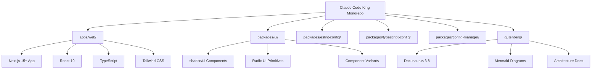

# Welcome to Claude Code King

**Claude Code King** is a modern **shadcn/ui monorepo** template built with cutting-edge technologies for scalable component-driven development.

## Overview

This is a production-ready monorepo featuring:

- **Apps**: Next.js 15+ applications with App Router and React 19
- **Packages**: Reusable shadcn/ui component library with shared configurations
- **Documentation**: Comprehensive guides powered by Docusaurus



## Tech Stack

### Core Technologies
- **Package Manager**: pnpm v10.14.0 with workspaces
- **Build System**: Turborepo v2.4.2 for orchestration
- **Node.js**: >=20 (optimized for latest features)

### Frontend Stack
- **Next.js**: v15.2.3 with App Router and Turbopack dev
- **React**: v19.0.0 with latest patterns and hooks
- **TypeScript**: v5.7.3 in strict mode
- **Tailwind CSS**: v4.0 with PostCSS architecture

### Component System
- **shadcn/ui**: Complete design system integration
- **Radix UI**: Accessible primitive components
- **Class Variance Authority**: Type-safe component variants
- **Lucide React**: Consistent icon system

## Quick Start

Get your development environment running in minutes:

```bash
# Clone and setup
git clone https://github.com/FrancisVarga/claude-code-king.git
cd claude-code-king

# Install dependencies
pnpm install

# Start development servers
pnpm dev

# Build for production
pnpm build
```

## Architecture Highlights

### Monorepo Benefits
- **Shared Dependencies**: Common tooling across all packages
- **Type Safety**: Cross-package TypeScript support
- **Build Optimization**: Incremental builds with dependency tracking
- **Code Sharing**: Reusable components and configurations

### Development Experience
- **Hot Reloading**: Instant feedback with Turbopack
- **Type Checking**: Real-time validation across packages
- **Consistent Tooling**: Shared ESLint, Prettier, and TypeScript configs
- **Component CLI**: Easy shadcn/ui component management

## What's Next?

Explore the documentation to understand:
- [Architecture Overview](./architecture/overview.md) - Deep dive into monorepo structure
- [Component System](./components/overview.md) - shadcn/ui integration patterns
- [Development Workflow](./workflows/development.md) - Day-to-day development practices
- [Package Management](./packages/overview.md) - Understanding workspace relationships

Ready to build something amazing? Let's get started! 🚀
