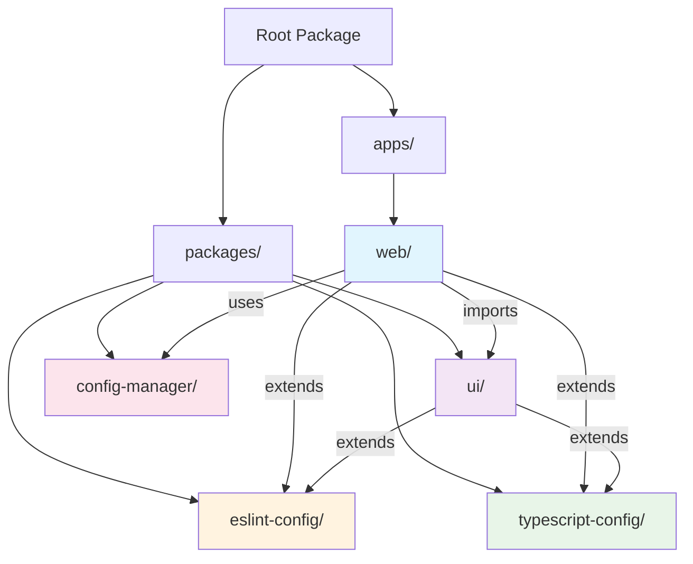
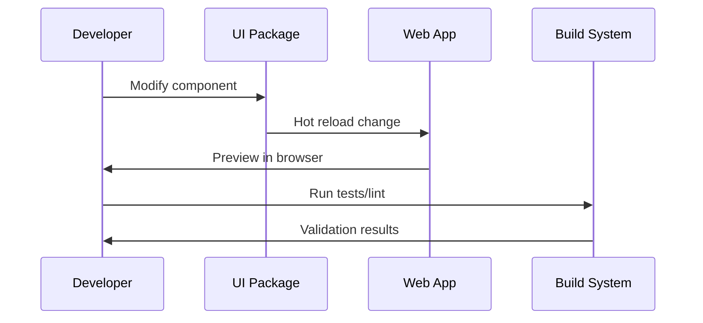

# Package Overview

Understanding the package architecture and relationships within the Claude Code King monorepo.

## Package Structure



## Package Relationships

### Dependency Graph

```mermaid
graph LR
    subgraph "External Dependencies"
        React[react@19]
        Next[next@15]
        Radix[@radix-ui/*]
        Tailwind[tailwindcss]
    end
    
    subgraph "Internal Packages"
        Web[apps/web] --> UI[packages/ui]
        Web --> ESLint[packages/eslint-config]
        Web --> TS[packages/typescript-config]
        
        UI --> ESLint
        UI --> TS
        UI --> Radix
        
        Web --> React
        Web --> Next
        UI --> Tailwind
    end
```

## Core Packages

### apps/web

**Purpose**: Main Next.js application consuming the UI package
**Type**: Application
**Dependencies**: Internal packages + Next.js ecosystem

```json
{
  "name": "web",
  "dependencies": {
    "@workspace/ui": "workspace:*",
    "next": "^15.2.3",
    "react": "^19.0.0",
    "react-dom": "^19.0.0"
  },
  "devDependencies": {
    "@workspace/eslint-config": "workspace:^",
    "@workspace/typescript-config": "workspace:*"
  }
}
```

**Key Features**:
- Next.js 15 with App Router
- React 19 with latest patterns
- Turbopack for fast development
- shadcn/ui component consumption

### packages/ui

**Purpose**: Reusable component library with shadcn/ui integration
**Type**: Library
**Consumers**: apps/web (and future apps)

```json
{
  "name": "@workspace/ui",
  "exports": {
    "./components/*": "./src/components/*.tsx",
    "./lib/*": "./src/lib/*.ts"
  },
  "dependencies": {
    "@radix-ui/react-*": "^1.x.x",
    "class-variance-authority": "^0.7.1",
    "lucide-react": "^0.475.0"
  }
}
```

**Key Features**:
- 50+ shadcn/ui components
- Radix UI accessibility primitives
- Type-safe variants with CVA
- Tailwind CSS styling system

### packages/eslint-config

**Purpose**: Shared ESLint configuration across all packages
**Type**: Configuration
**Consumers**: All packages requiring linting

```json
{
  "name": "@workspace/eslint-config",
  "main": "./base.js",
  "exports": {
    "./base": "./base.js",
    "./next": "./next.js",
    "./react": "./react.js"
  },
  "dependencies": {
    "eslint": "^8.x.x",
    "eslint-plugin-only-warn": "^1.1.0"
  }
}
```

**Configurations Available**:
- **base.js**: Core ESLint rules
- **next.js**: Next.js specific rules
- **react.js**: React specific rules

### packages/typescript-config

**Purpose**: Shared TypeScript configurations
**Type**: Configuration
**Consumers**: All TypeScript packages

```json
{
  "name": "@workspace/typescript-config",
  "exports": {
    "./base.json": "./base.json",
    "./nextjs.json": "./nextjs.json",
    "./react-library.json": "./react-library.json"
  }
}
```

**Configurations Available**:
- **base.json**: Core TypeScript settings
- **nextjs.json**: Next.js optimized settings
- **react-library.json**: React library settings

### packages/config-manager

**Purpose**: Configuration management utilities
**Type**: Utility Library
**Consumers**: Apps requiring configuration management

```json
{
  "name": "@workspace/config-manager",
  "exports": {
    ".": "./dist/index.js",
    "./env": "./dist/env.js"
  },
  "dependencies": {
    "zod": "^3.24.2"
  }
}
```

**Key Features**:
- Environment variable loading
- Type-safe configuration access
- Runtime validation with Zod

## Package Export Patterns

### Direct Exports (Recommended)

```typescript
// packages/ui/package.json
{
  "exports": {
    "./components/button": "./src/components/button.tsx",
    "./components/input": "./src/components/input.tsx",
    "./lib/utils": "./src/lib/utils.ts"
  }
}

// Usage in apps
import { Button } from "@workspace/ui/components/button"
import { cn } from "@workspace/ui/lib/utils"
```

### Configuration Exports

```typescript
// packages/eslint-config/package.json
{
  "exports": {
    "./base": "./base.js",
    "./next": "./next.js"
  }
}

// Usage in apps
// .eslintrc.js
module.exports = {
  extends: ["@workspace/eslint-config/next"]
}
```

## Development Workflow

### Package Development Cycle



### Cross-Package Development

1. **Make changes in packages/ui**
2. **Changes automatically available in apps/web**
3. **Hot reload provides instant feedback**
4. **Type checking validates across packages**

## Package Scripts

### Common Scripts

Each package includes standard scripts:

```json
{
  "scripts": {
    "build": "tsc",
    "dev": "tsc --watch",
    "lint": "eslint .",
    "typecheck": "tsc --noEmit"
  }
}
```

### Turborepo Task Execution

```bash
# Run script across all packages
pnpm build          # Builds all packages
pnpm dev           # Starts all dev servers
pnpm lint          # Lints all packages

# Run script in specific package
pnpm --filter web build
pnpm --filter @workspace/ui dev
```

## Version Management

### Workspace Protocol

All internal dependencies use the `workspace:*` protocol:

```json
{
  "dependencies": {
    "@workspace/ui": "workspace:*",
    "@workspace/eslint-config": "workspace:^"
  }
}
```

**Benefits**:
- Always uses local package version
- Supports pnpm workspace linking
- Enables seamless development workflow

### Release Strategy

```bash
# Version bump (when ready for release)
pnpm changeset

# Publish packages (if releasing publicly)
pnpm changeset publish
```

## Package Dependencies

### External Dependency Management

```mermaid
graph TD
    A[Root package.json] --> B[Shared Dev Dependencies]
    B --> C[typescript]
    B --> D[turbo]
    B --> E[prettier]
    
    F[packages/ui] --> G[Component Dependencies]
    G --> H[@radix-ui/*]
    G --> I[lucide-react]
    G --> J[class-variance-authority]
    
    K[apps/web] --> L[App Dependencies]
    L --> M[next]
    L --> N[react]
    L --> O[react-dom]
```

### Dependency Guidelines

1. **Shared dependencies**: Place in root `package.json`
2. **Package-specific**: Keep in individual `package.json`
3. **Peer dependencies**: Use for packages consumed by apps
4. **Dev dependencies**: Share configurations, isolate build tools

## Adding New Packages

### Package Creation Template

```bash
# Create new package directory
mkdir packages/new-package

# Initialize package.json
cd packages/new-package
cat > package.json << EOF
{
  "name": "@workspace/new-package",
  "version": "0.0.0",
  "type": "module",
  "exports": {
    ".": "./dist/index.js"
  },
  "scripts": {
    "build": "tsc",
    "dev": "tsc --watch",
    "lint": "eslint .",
    "typecheck": "tsc --noEmit"
  },
  "devDependencies": {
    "@workspace/eslint-config": "workspace:*",
    "@workspace/typescript-config": "workspace:*"
  }
}
EOF

# Add TypeScript config
cat > tsconfig.json << EOF
{
  "extends": "@workspace/typescript-config/base.json",
  "compilerOptions": {
    "outDir": "dist"
  },
  "include": ["src"]
}
EOF
```

This package architecture provides a scalable foundation for managing complex applications while maintaining clear boundaries and efficient development workflows.