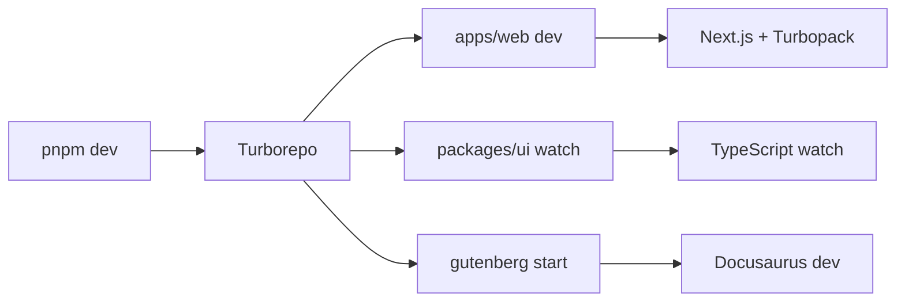
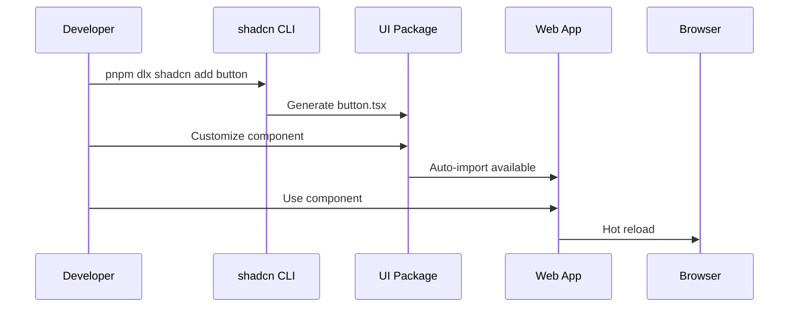
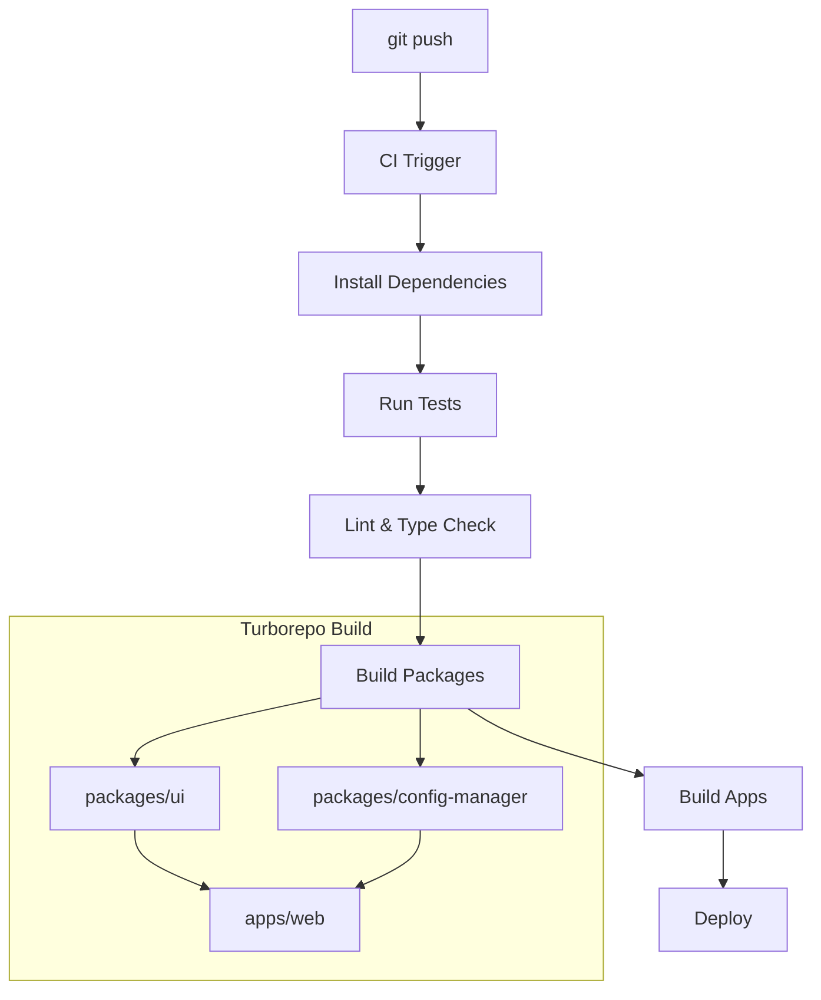

# Development Workflow

This guide covers the day-to-day development practices and workflows for working with the Claude Code King monorepo.

## Getting Started

### Initial Setup

```bash
# Clone the repository
git clone https://github.com/FrancisVarga/claude-code-king.git
cd claude-code-king

# Install dependencies (this will install for all packages)
pnpm install

# Start development servers for all packages
pnpm dev
```

### Development Server

When you run `pnpm dev`, Turborepo starts multiple development servers:



**Servers started:**
- **Web app**: `http://localhost:3000` (Next.js with Turbopack)
- **Documentation**: `http://localhost:3001` (Docusaurus)
- **UI package**: Watch mode for component changes

## Daily Development Tasks

### Adding Components

#### Using shadcn/ui CLI

```bash
# Add a new component (run from root)
pnpm dlx shadcn@latest add card -c apps/web

# Components are placed in packages/ui/src/components/
# Automatically available as @workspace/ui/components/card
```

#### Manual Component Creation

```bash
# Create a custom component
touch packages/ui/src/components/custom-component.tsx

# Add to package exports if needed
# Edit packages/ui/package.json exports field
```

### Working with Packages

#### Package Scripts

```bash
# Build all packages
pnpm build

# Lint all packages
pnpm lint

# Type check all packages
pnpm typecheck

# Clean all build artifacts
pnpm clean
```

#### Working in Specific Packages

```bash
# Work in the web app only
cd apps/web
pnpm dev

# Work in the UI package only
cd packages/ui
pnpm dev

# Work in documentation only
cd gutenberg
pnpm start
```

### Code Quality

#### Linting and Formatting

```bash
# Run ESLint on all packages
pnpm lint

# Fix linting issues automatically
pnpm lint:fix

# Format code with Prettier
pnpm format
```

#### Type Checking

```bash
# Type check all packages
pnpm typecheck

# Type check specific package
cd apps/web
pnpm typecheck
```

## Component Development

### Component Creation Flow



### Best Practices

#### Import Patterns

```typescript
// ✅ Preferred - Direct imports
import { Button } from "@workspace/ui/components/button"
import { cn } from "@workspace/ui/lib/utils"

// ❌ Avoid - Barrel imports
import { Button } from "@workspace/ui"

// ✅ App-specific imports
import { Header } from "@/components/header"
import { config } from "@/lib/config"
```

#### Component Structure

```typescript
// packages/ui/src/components/example.tsx
import * as React from "react"
import { cva, type VariantProps } from "class-variance-authority"
import { cn } from "@workspace/ui/lib/utils"

const exampleVariants = cva(
  "base-classes",
  {
    variants: {
      variant: {
        default: "default-styles",
        secondary: "secondary-styles",
      },
      size: {
        default: "default-size",
        sm: "small-size",
      },
    },
    defaultVariants: {
      variant: "default",
      size: "default",
    },
  }
)

export interface ExampleProps
  extends React.HTMLAttributes<HTMLDivElement>,
    VariantProps<typeof exampleVariants> {
  asChild?: boolean
}

const Example = React.forwardRef<HTMLDivElement, ExampleProps>(
  ({ className, variant, size, asChild = false, ...props }, ref) => {
    const Comp = asChild ? Slot : "div"
    return (
      <Comp
        className={cn(exampleVariants({ variant, size, className }))}
        ref={ref}
        {...props}
      />
    )
  }
)
Example.displayName = "Example"

export { Example, exampleVariants }
```

## Testing Strategies

### Component Testing

```typescript
// packages/ui/src/components/__tests__/button.test.tsx
import { render, screen } from "@testing-library/react"
import { Button } from "../button"

describe("Button", () => {
  it("renders correctly", () => {
    render(<Button>Click me</Button>)
    expect(screen.getByRole("button")).toHaveTextContent("Click me")
  })

  it("applies variant classes", () => {
    render(<Button variant="destructive">Delete</Button>)
    expect(screen.getByRole("button")).toHaveClass("bg-destructive")
  })
})
```

### Integration Testing

```typescript
// apps/web/__tests__/integration/form.test.tsx
import { render, screen, fireEvent } from "@testing-library/react"
import { ContactForm } from "@/components/contact-form"

describe("Contact Form", () => {
  it("submits form with valid data", async () => {
    render(<ContactForm />)
    
    fireEvent.change(screen.getByLabelText("Email"), {
      target: { value: "test@example.com" }
    })
    
    fireEvent.click(screen.getByRole("button", { name: "Submit" }))
    
    // Assert submission behavior
  })
})
```

## Build and Deployment

### Local Build

```bash
# Build all packages in correct order
pnpm build

# Build specific package
cd apps/web
pnpm build
```

### Build Pipeline



### Production Deployment

```bash
# Production build
pnpm build

# Start production server (Next.js)
cd apps/web
pnpm start

# Serve documentation
cd gutenberg
pnpm serve
```

## Troubleshooting

### Common Issues

#### Module Resolution

```bash
# Clear node_modules and reinstall
rm -rf node_modules
rm -rf apps/*/node_modules
rm -rf packages/*/node_modules
pnpm install
```

#### Type Errors

```bash
# Restart TypeScript server in VS Code
# Command Palette -> "TypeScript: Restart TS Server"

# Or rebuild TypeScript references
pnpm typecheck
```

#### Build Cache Issues

```bash
# Clear Turborepo cache
pnpm turbo clean

# Clear Next.js cache
cd apps/web
rm -rf .next
```

### Performance Optimization

#### Development Mode

- **Use Turbopack**: Enabled by default in Next.js dev mode
- **Parallel builds**: Turborepo runs tasks in parallel
- **Watch mode**: TypeScript compilation in watch mode

#### Build Optimization

```bash
# Analyze bundle size
cd apps/web
pnpm analyze

# Check build performance
pnpm turbo build --profile
```

## Git Workflow

### Branch Strategy

```bash
# Feature development
git checkout -b feature/new-component
git commit -m "feat: add new component"
git push origin feature/new-component

# Create pull request
# Merge after review
```

### Commit Conventions

```bash
# Feature additions
git commit -m "feat: add new dashboard component"

# Bug fixes
git commit -m "fix: resolve button accessibility issue"

# Documentation
git commit -m "docs: update component usage guide"

# Refactoring
git commit -m "refactor: improve component prop types"
```

This workflow ensures efficient development while maintaining code quality and consistency across the monorepo.